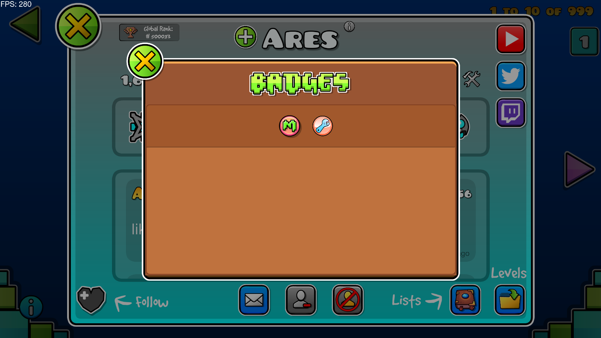

# Badges API

</img>
<a href="https://discord.gg/MU4Rpc6xbJ" style="text-align: center;"></img></a>
</img>
</img>
</img>
</img>

An API mod to integrate badges in a special menu & optimizing UI for ProfilePage & CommentCell



This mod use **NodeIDs** as a dependency to make tags working well, you may use it if you want to use this API.

## Using as a dependency

Add the mod to your `mod.json`:

```json
{
    "dependencies": [
        {
            "id": "jouca.badgesapi",
            "version": ">=v1.2.2",
            "importance": "required"
        },
        {
            "id": "geode.node-ids",
            "version": ">=v1.20.1",
            "importance": "required"
        }
    ]
}
```

**All the hooks on this API are in very low priority states, you should make sure that your mod doesn't go too much bellow the priorities that Badges API uses for correctly detecting your badges.**

## How to use this mod?

* For `ProfilePage` & `CommentCell`, you need to make sure that your badge is in the `CCMenu*` with the ID `username-menu`. **Make sure to put an ID on your badge which contains `-badge` inside of it.** 

Here's an example of how to put your badge inside:

```cpp
#include <Geode/Geode.hpp>
#include <Geode/modify/ProfilePage.hpp>
#include <Geode/modify/CommentCell.hpp>

using namespace geode::prelude;

class $modify(ProfilePage) {
    void loadPageFromUserInfo(GJUserScore* a2) {
        ProfilePage::loadPageFromUserInfo(a2);
        auto layer = m_mainLayer;
        
        CCMenu* username_menu = static_cast<CCMenu*>(layer->getChildByIDRecursive("username-menu"));

        // your code for create your badge
        
        yourBadge->setID("mycustombadge-badge")
        username_menu->addChild(yourBadge);
        username_menu->updateLayout();
    }
};

class $modify(CommentCell) {
    void loadFromComment(GJComment* p0) {
        CommentCell::loadFromComment(p0);
        auto layer = m_mainLayer;
        
        CCMenu* username_menu = static_cast<CCMenu*>(layer->getChildByIDRecursive("username-menu"));

        // your code for create your badge

        yourBadge->setID("mycustombadge-badge")
        username_menu->addChild(yourBadge);
        username_menu->updateLayout();
    }
};
```

__**If you add your badge after the Layer has loaded (example with HTTP requests), it will still be added!**__

## Credits
* [Jouca](https://twitter.com/JoucaJouca)
* elnexreal - Logo for the mod
* [Mave](https://x.com/gmdpeter) - Plus button texture

## Contributors
* [hiimjustin000](https://x.com/hiimjustin000)

## License
This project is created by [Jouca](https://github.com/Jouca) under the [GNU General Public License v3.0](https://choosealicense.com/licenses/gpl-3.0/), read more by clicking on the highlighted name.
