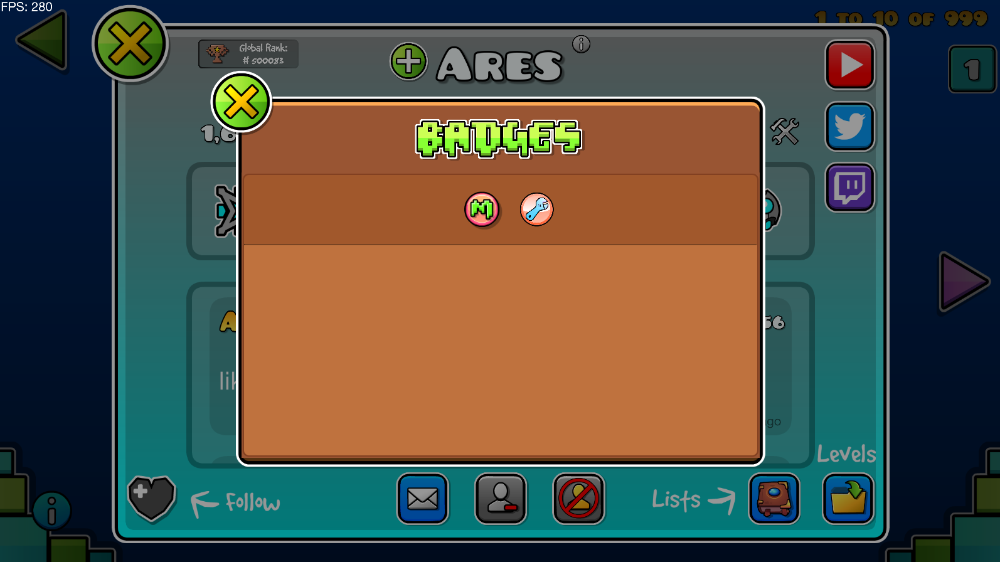

# Badges API

</img>
<a href="https://discord.gg/MU4Rpc6xbJ" style="text-align: center;"></img></a>
</img>
</img>
</img>
</img>

An API mod to integrate badges in a special menu & optimizing UI for ProfilePage & CommentCell



This mod use **NodeIDs** as a dependency to make tags working well, you may use it if you want to use this API.

## Using as a dependency

Add the mod to your `mod.json`:

```json
{
    "dependencies": [
        {
            "id": "jouca.badgesapi",
            "version": ">=v1.4.2",
            "importance": "required"
        },
        {
            "id": "geode.node-ids",
            "version": ">=v1.23.3",
            "importance": "required"
        }
    ]
}
```

**All the hooks on this API are in very low priority states, you should make sure that your mod doesn't go too much bellow the priorities that Badges API uses for correctly detecting your badges.**

## How to use this mod?

* For `ProfilePage` & `CommentCell`, you need to make sure that your badge is in the `CCMenu*` with the ID `username-menu`. **Make sure to put an ID on your badge which contains `-badge` inside of it.**

Here's an example of how to put a **non-clickable** badge inside:

```cpp
#include <Geode/Geode.hpp>
#include <Geode/modify/ProfilePage.hpp>
#include <Geode/modify/CommentCell.hpp>

using namespace geode::prelude;

class $modify(ProfilePage) {
    void loadPageFromUserInfo(GJUserScore* a2) {
        ProfilePage::loadPageFromUserInfo(a2);
        auto layer = m_mainLayer;

        CCMenu* username_menu = static_cast<CCMenu*>(layer->getChildByIDRecursive("username-menu"));

        auto yourBadge = CCSprite::createWithSpriteFrameName("yourBadgeSprite.png"_spr);
        yourBadge->setID("mycustombadge-badge"_spr);
        username_menu->addChild(yourBadge);
        username_menu->updateLayout();
    }
};

class $modify(CommentCell) {
    void loadFromComment(GJComment* p0) {
        CommentCell::loadFromComment(p0);
        auto layer = m_mainLayer;

        CCMenu* username_menu = static_cast<CCMenu*>(layer->getChildByIDRecursive("username-menu"));

        auto yourBadge = CCSprite::createWithSpriteFrameName("yourBadgeSprite.png"_spr);
        yourBadge->setID("mycustombadge-badge"_spr);
        username_menu->addChild(yourBadge);
        username_menu->updateLayout();
    }
};
```

### Clickable badges

If you want your badge to open a popup or trigger an action when clicked, use `CCMenuItemExt::createSpriteExtra` from the Geode SDK. This ensures the click callback works correctly both in the menu and inside the BadgesAPI show-more popup.

> **Do not use UIBuilder's `intoMenuItem`** for badge buttons — it stores the callback as a child node of the button, which can be invalidated when BadgesAPI moves buttons around.

```cpp
#include <Geode/Geode.hpp>
#include <Geode/modify/ProfilePage.hpp>
#include <Geode/modify/CommentCell.hpp>

using namespace geode::prelude;

class $modify(ProfilePage) {
    void loadPageFromUserInfo(GJUserScore* a2) {
        ProfilePage::loadPageFromUserInfo(a2);
        auto layer = m_mainLayer;

        CCMenu* username_menu = static_cast<CCMenu*>(layer->getChildByIDRecursive("username-menu"));

        auto sprite = CCSprite::createWithSpriteFrameName("yourBadgeSprite.png"_spr);
        auto yourBadge = CCMenuItemExt::createSpriteExtra(sprite, [](CCMenuItemSpriteExtra*) {
            FLAlertLayer::create(nullptr, "My Badge", "Badge description here.", "OK", nullptr, 300.f)->show();
        });
        yourBadge->setID("mycustombadge-badge"_spr);
        username_menu->addChild(yourBadge);
        username_menu->updateLayout();
    }
};

class $modify(CommentCell) {
    void loadFromComment(GJComment* p0) {
        CommentCell::loadFromComment(p0);
        auto layer = m_mainLayer;

        CCMenu* username_menu = static_cast<CCMenu*>(layer->getChildByIDRecursive("username-menu"));

        auto sprite = CCSprite::createWithSpriteFrameName("yourBadgeSprite.png"_spr);
        auto yourBadge = CCMenuItemExt::createSpriteExtra(sprite, [](CCMenuItemSpriteExtra*) {
            FLAlertLayer::create(nullptr, "My Badge", "Badge description here.", "OK", nullptr, 300.f)->show();
        });
        yourBadge->setID("mycustombadge-badge"_spr);
        username_menu->addChild(yourBadge);
        username_menu->updateLayout();
    }
};
```

* You also have the possibility **(optionally)** to **put a priority tag** on the ID to your badge to place it **higher on the list** than some other badges using `:{priority number}`.

```cpp
yourBadge->setID("mycustombadge-badge:100"_spr);
```

__**If you add your badge after the Layer has loaded (example with HTTP requests), it will still be added!**__

## Credits
* [Jouca](https://twitter.com/JoucaJouca)
* elnexreal - Logo for the mod
* [Mave](https://x.com/gmdpeter) - Plus button texture

## Contributors
* [hiimjustin000](https://x.com/hiimjustin000)
* [RayDeeUx](https://github.com/RayDeeUx)
* [Fire](https://github.com/FireMario211)

## License
This project is created by [Jouca](https://github.com/Jouca) under the [GNU General Public License v3.0](https://choosealicense.com/licenses/gpl-3.0/), read more by clicking on the highlighted name.
