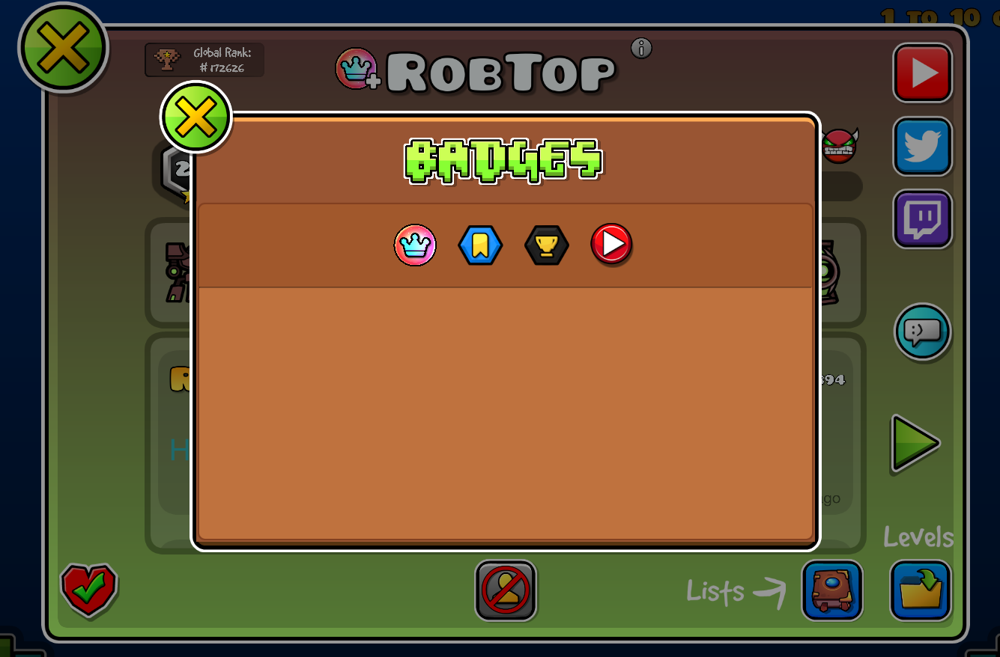

# Badges API

An API mod for a better display for badges.



This mod use **NodeIDs** as a dependency to make tags working well, you may use it if you want to use this API.

## Using as a dependency

Add the mod to your `mod.json`:

```json
{
    "dependencies": [
        {
            "id": "jouca.badgesapi",
            "version": ">=v1.0.0",
            "importance": "required"
        }
    ]
}
```

**All the hooks on this API are in very low priority states, you should make sure that your mod doesn't go too much bellow the priorities that Badges API uses for correctly detecting your badges.**

## How to use this mod?

* For `ProfilePage`, you need to make sure that your badge is in the `CCMenu*` with the ID `username-menu`. Here's an example of how to put your badge inside:

```cpp
#include <Geode/Geode.hpp>
#include <Geode/modify/ProfilePage.hpp>

using namespace geode::prelude;

class $modify(ProfilePage) {
	void loadPageFromUserInfo(GJUserScore* a2) {
		ProfilePage::loadPageFromUserInfo(a2);

		auto layer = m_mainLayer;

		CCMenu* username_menu = typeinfo_cast<CCMenu*>(layer->getChildByIDRecursive("username-menu"));

        ...

        username_menu->addChild(yourBadge);
    }
};
```